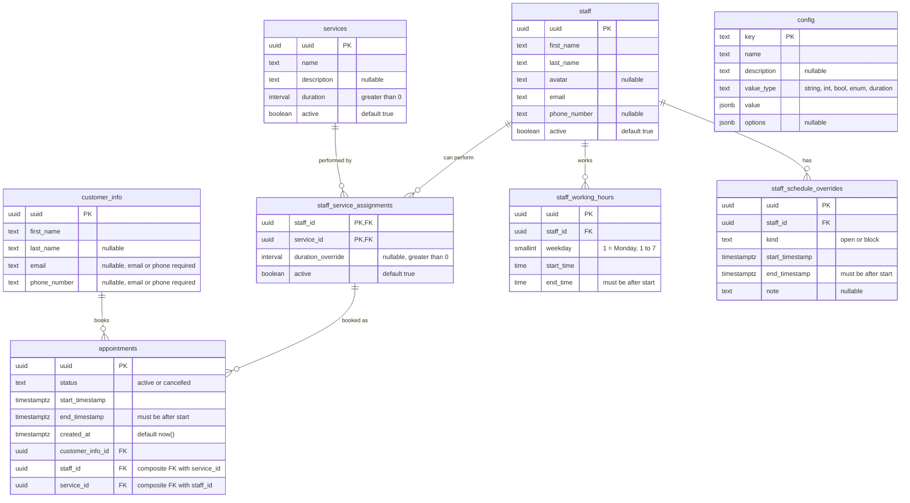

# Database Schema

```mermaid
erDiagram
    customer_info ||--o{ appointments : "books"
    staff ||--o{ staff_service_assignments : "can perform"
    services ||--o{ staff_service_assignments : "performed by"
    staff_service_assignments ||--o{ appointments : "booked as"
    staff ||--o{ staff_working_hours : "works"
    staff ||--o{ staff_schedule_overrides : "has"

    appointments {
        uuid uuid PK
        text status "active or cancelled"
        timestamptz start_timestamp
        timestamptz end_timestamp "must be after start"
        timestamptz created_at "default now()"
        uuid customer_info_id FK
        uuid staff_id FK "composite FK with service_id"
        uuid service_id FK "composite FK with staff_id"
    }

    customer_info {
        uuid uuid PK
        text first_name
        text last_name "nullable"
        text email "nullable, email or phone required"
        text phone_number "nullable, email or phone required"
    }

    services {
        uuid uuid PK
        text name
        text description "nullable"
        interval duration "greater than 0"
        boolean active "default true"
    }

    staff {
        uuid uuid PK
        text first_name
        text last_name
        text avatar "nullable"
        text email
        text phone_number "nullable"
        boolean active "default true"
    }

    staff_service_assignments {
        uuid staff_id PK, FK
        uuid service_id PK, FK
        interval duration_override "nullable, greater than 0"
        boolean active "default true"
    }

    staff_working_hours {
        uuid uuid PK
        uuid staff_id FK
        smallint weekday "1 = Monday, 1 to 7"
        time start_time
        time end_time "must be after start"
    }

    staff_schedule_overrides {
        uuid uuid PK
        uuid staff_id FK
        text kind "open or block"
        timestamptz start_timestamp
        timestamptz end_timestamp "must be after start"
        text note "nullable"
    }

    config {
        text key PK
        text name
        text description "nullable"
        text value_type "string, int, bool, enum, duration"
        jsonb value
        jsonb options "nullable"
    }
```
